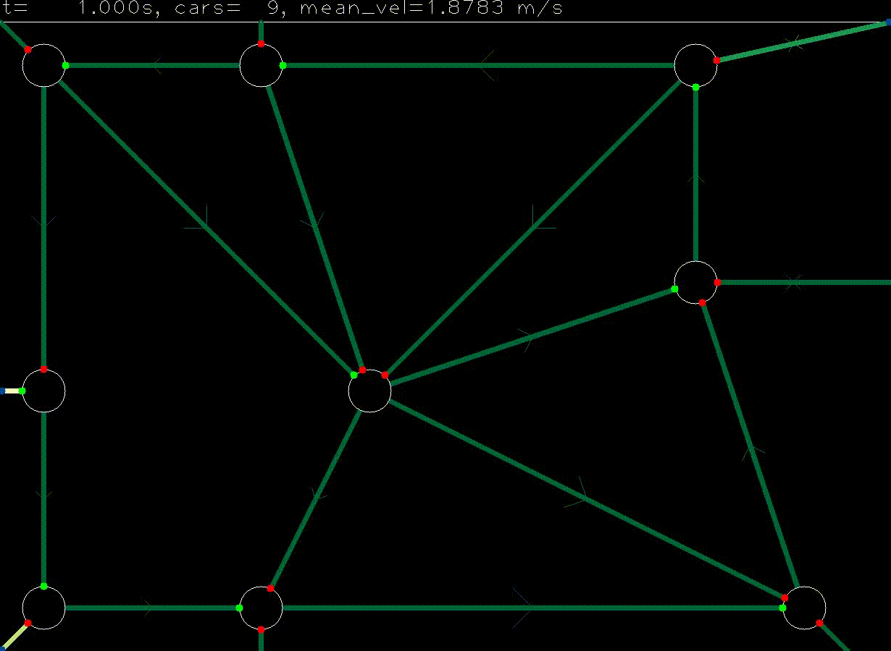

# gym-traffic

OpenAI Gym Environment for traffic lights simulation:

* Street network as directed graph
    * The world consists of multiple intersections.
    * Intersections are connected with streets.
    * Intersections have traffic lights for each incoming street.
    * Traffic lights can either be red or green.
    * For each intersection there cannot be more than one green light.
    * Vehicles can spawn at some intersections with a predefined route.
    * Vehicles drive on streets and stop at red traffic lights.
    * Vehicles do not crash into each other.
    
An Agent has to control the traffic lights.


## Installation
### Requirements

This project was solved using Python 3.8.6

Requires:

* OpenAI gym (`pip intall gym`)
* PyTorch ([Installation Guide](https://pytorch.org/get-started/locally/))
* OpenCV (`pip install opencv-python`) (for visualization)
* tqdm (`pip install tqdm`) (for progressbar in evaluation)
* stable-baselines3 (for training agents) (`pip install stable-baselines3`)

## Features

### Hyperparameter
First of all there are two possible environments.

#### Multi-Discrete environment (Conventional approach)
| parameter | description | possible settings/default | 
| --------- | ----------- | ----------------- |
| horizon | number of steps in until done | 1000 |
| calculation_frequency | time steps in which the simulation is calculated | 0.01 |
| action_frequency | time which has to pass until env asks for new action | 1 |
| reward_type | Method that gives the reward | `mean_velocity`, `acceleration` |

#### Single-Discrete environment (Generalized approach)
| parameter | description | possible settings/default | 
| --------- | ----------- | ----------------- |
| horizon | number of steps in until done | 1000 |
| calculation_frequency | time steps in which the simulation is calculated | 0.01 |
| action_frequency | time which has to pass until env asks for new action | 1 |
| reward_type | Method that gives the reward | `mean_velocity`, `acceleration` |
| shuffle_streets | order of observation is randomized if set to true. Can be helpful for training |`True`, `False` |
|  |  |

## Hardware Setup
The training was done with following setup:

|  |  |
| ---- | ---- |
OS | Windows 10, Version 1909
CPU | Intel(R) Core(TM) i5-10500 CPU @ 3.10GHz, 3096 MHz
RAM | 32GB DDR4 (2666MHz)
GPU | NVIDIA Quadro P2200
## Training
An example for training an agent with this environment is given in `src/examples/train.py`
Execute with:
````shell
cd src
python examples/train.py
````


## Results

### Single Traffic light environment

| Algorithm | Hours trained | Mean Velocity | Mean reward (acceleration) |
| --------- | ------------- | ------------- | -------------------------- |
| random | - | 